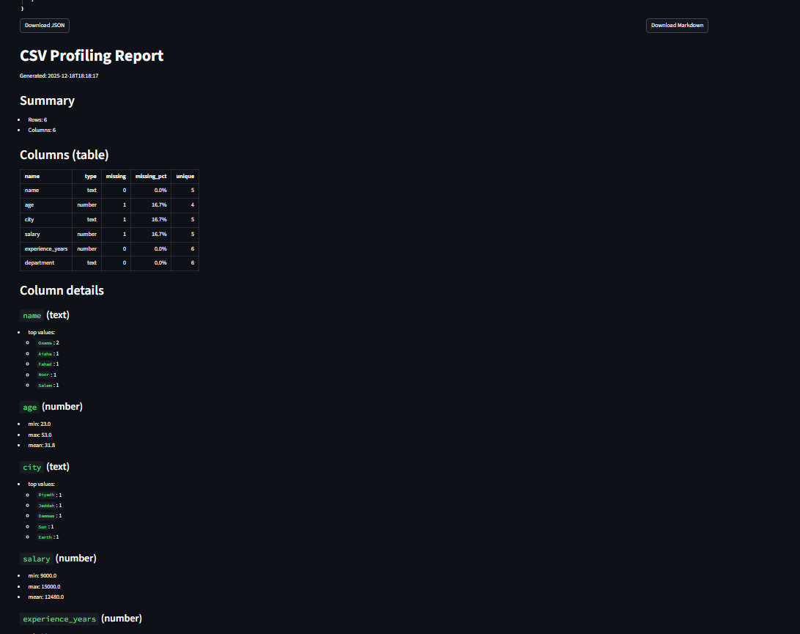
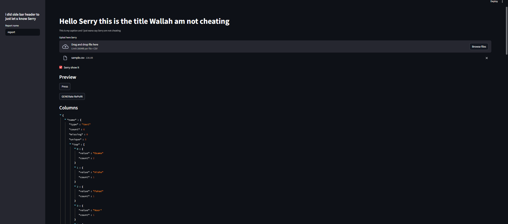
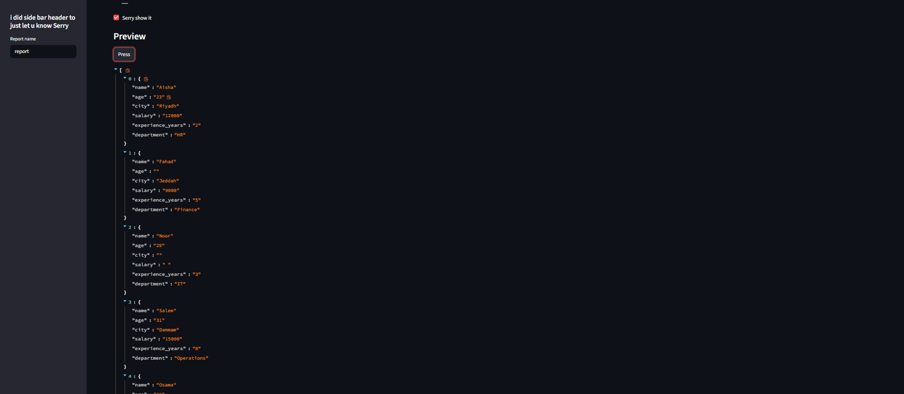

# CSV Profiler
Generate a profiling report for a CSV file.

## Features
- CLI: Generate JSON and Markdown reports
- Streamlit GUI: Upload CSV and export reports

## Setup
```bash
cd csv-profiler
uv venv -p 3.11
uv pip install -r requirements.txt
```

## Run CLI
```bash
# If you have a src/ folder:
#   Mac/Linux: export PYTHONPATH=src
#   Windows:   $env:PYTHONPATH="src"

uv run python -m csv_profiler.cli data/sample.csv --out-dir outputs
```

## Run GUI
```bash
# If you have a src/ folder:
#   Mac/Linux: export PYTHONPATH=src
#   Windows:   $env:PYTHONPATH="src"

uv run streamlit run app.py
```

## Output Files

### CLI
- `outputs/report.json`
- `outputs/report.md`

### Streamlit App
- Preview the report
- Download JSON and Markdown files

## Screenshots
  
  

